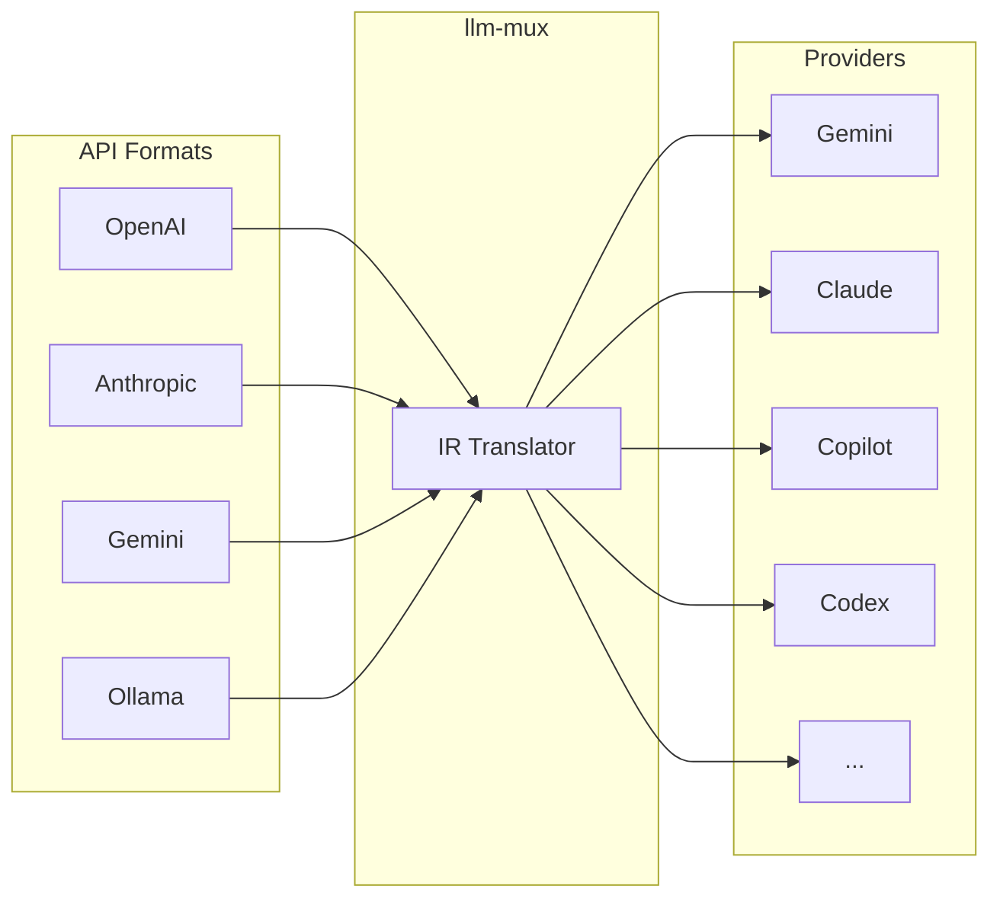

# llm-mux

[](https://github.com/nghyane/llm-mux/releases)
[](https://opensource.org/licenses/MIT)

**Turn your AI subscriptions into standard API endpoints.**

A local gateway that enables your Claude Pro, GitHub Copilot, and Google Gemini subscriptions to work with any AI tool.

## Quick Install

```bash
# macOS / Linux
curl -fsSL https://raw.githubusercontent.com/nghyane/llm-mux/main/install.sh | bash

# Windows (PowerShell)
irm https://raw.githubusercontent.com/nghyane/llm-mux/main/install.ps1 | iex
```

## Quick Start

```bash
# 1. Login to a provider
llm-mux --antigravity-login   # Google Gemini
llm-mux --claude-login        # Claude Pro/Max
llm-mux --copilot-login       # GitHub Copilot

# 2. Start the server (runs as background service after install)
llm-mux

# 3. Verify
curl http://localhost:8317/v1/models
```

## Use With Any Tool

```
Base URL: http://localhost:8317/v1
API Key:  unused
```

**Python:**
```python
from openai import OpenAI
client = OpenAI(base_url="http://localhost:8317/v1", api_key="unused")
response = client.chat.completions.create(
    model="gemini-2.5-pro",
    messages=[{"role": "user", "content": "Hello!"}]
)
```

**cURL:**
```bash
curl http://localhost:8317/v1/chat/completions \
  -H "Content-Type: application/json" \
  -d '{"model": "gemini-2.5-pro", "messages": [{"role": "user", "content": "Hello!"}]}'
```

## Documentation

| Guide | Description |
|-------|-------------|
| [Installation](docs/installation.md) | Install options, update, uninstall |
| [Providers](docs/providers.md) | All supported providers and login commands |
| [Configuration](docs/configuration.md) | Config file reference |
| [API Reference](docs/api-reference.md) | Supported API formats and endpoints |
| [Integrations](docs/integrations/) | Cursor, VS Code, Aider, LangChain, etc. |
| [Docker](docs/docker.md) | Container deployment |
| [Service Management](docs/service-management.md) | Background service on macOS/Linux/Windows |
| [Troubleshooting](docs/troubleshooting.md) | Common issues and solutions |

## Supported Providers

| Provider | Command | Models |
|----------|---------|--------|
| Google Gemini | `--antigravity-login` | gemini-2.5-pro, gemini-2.5-flash |
| Claude | `--claude-login` | claude-sonnet-4, claude-opus-4.5 |
| GitHub Copilot | `--copilot-login` | gpt-4.1, gpt-4o, gpt-5 |
| OpenAI Codex | `--codex-login` | gpt-5 series |

See [all providers](docs/providers.md) for Qwen, Kiro, Cline, iFlow, and more.

## Architecture



## License

MIT License — see [LICENSE](LICENSE)
